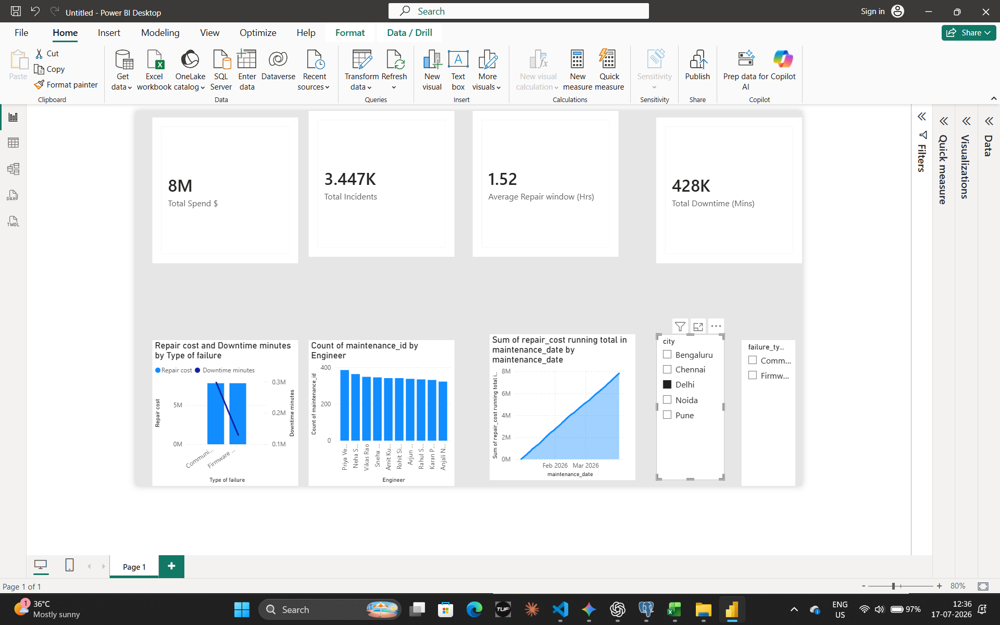
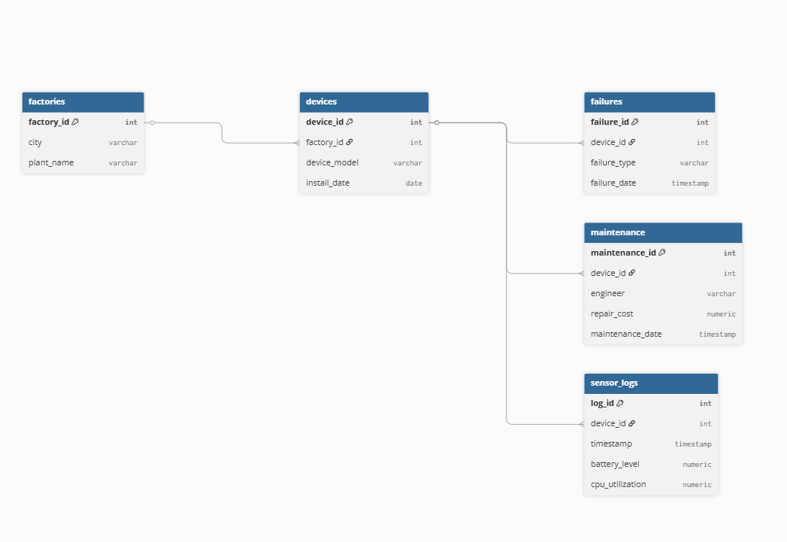

# IoT Device Maintenance and Analytics Platform

This project is a data analysis system for tracking enterprise factory machines and electronic devices. It uses sensor logs, plant locations, failure records, and repair histories to help operations teams find equipment problems, fix breakdowns faster, and reduce overall repair costs.

## Technical Stack

* **Database:** PostgreSQL 18
* **Language:** SQL
* **Data Visualization & DAX:** Power BI Desktop
* **Methods used:** Relational joins, date and time filtering, group by aggregations, case statements, common table expressions (CTEs), window functions like LAG, and native quick measures.
* **Version Control:** Git & GitHub Workflow

## Dashboard Preview

Below is the interactive reporting interface used by operations teams to monitor real-time factory KPIs, technician workloads, and operational spend.

## Database Architecture & Schema Design

The project utilizes a clean Star Schema data model to optimize application function, maintain query performance, and ensure reliable filtering mechanics.
This screenshot provides a direct view of how the relational schema is designed.

## Core Dashboard Features

* **Summary Cards:** Displays total incidents (~16.4K), average repair time (1.5 hours), total downtime (2M minutes), and total maintenance cost ($37M).
* **Failure Type Analysis:** A dual-axis chart comparing repair cost against downtime. It shows that while Firmware and Communication failures cost the same, Communication issues cause significantly more factory downtime.
* **Engineer Tracker:** A horizontal bar chart counting the exact number of distinct maintenance tickets resolved by each technician to monitor workload balance.
* **Cumulative Spend:** An area chart showing the continuous running total of repair expenses growing day by day over the quarter.
* **Interactive Slicers:** Dropdown filters that let users instantly slice the entire report by Factory City or Failure Type.

## Business and Operational Problems Solved

The SQL script and dashboard answer specific questions that help teams manage operations:

* **Engineer Performance:** Finds the top 3 repair technicians by counting their completed tasks to help balance workloads.
* **Targeted Asset Tracking:** Pinpoints specific technical bugs, like antenna replacements, that happened specifically during January 2026.
* **Factory Risk Analysis:** Connects machine failures to their physical factory locations to show which plants have the most downtime.
* **Chronic Problem Alerts:** Flags specific machine IDs that have broken down more than twice for the exact same issue.
* **Product Patch Prioritization:** Groups historical repair logs so product managers know whether to invest in hardware updates or software patches first.
* **Benchmarking Performance:** Uses a CTE to find which individual factories have higher failure rates than the network average.
* **Machine Lifespan Tracking:** Uses the LAG window function to calculate the exact number of days a device runs properly between consecutive breakdowns.
* **Battery Drain Analysis:** Identifies devices experiencing aggressive power drops by flagging hardware where battery level fell below 20% while under normal CPU utilization.
* **Critical Error Log Correlations:** Maps extreme internal temperature spikes and high memory usage errors directly to subsequent physical system failures.
* **Downtime Cost Projections:** Aggregates total minutes lost per device model to calculate the overall financial impact of system idleness across different hardware generations.

## Project Structure

* `/data`: Folder containing the raw data tables in CSV format (devices, factories, failures, maintenance, sensor logs).
* `queries.sql`: The main SQL script containing all the baseline and advanced database queries.
* `dashboard.png`: Screenshot preview of the final Power BI dashboard.
* `IoT_Device_Dashboard.pbix`: The working Power BI desktop file containing the data model and interactive layouts.